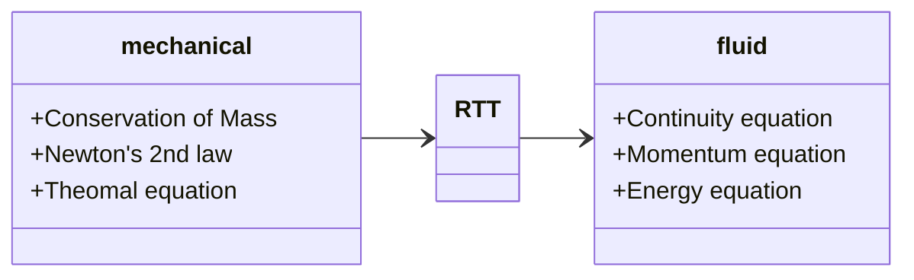



Feeling unsafe when deploying CFD algorithms, the best way to alleviate the anxiety is to derive the fundamentals again.



<!-- more -->

## 1 Control Volumes

### 1.1 Basic Physical laws of fluid Mechanics

#### 1.1.1 Control mass & *Lagrangian* frame of reference

4 terms & 3 facts:

- A *system (or control mass)* is a collection of moving particles of interest. 

- The *boundary* separates the system with its *surroundings*.
- The boundary may move and deform with the moving particles.

#### 1.1.2 Laws of Mechanics

3 laws of a control mass (suitable for bath fluid and solid systems):

- Conservation of mass
  $$
  m=const\text {  or equivalently } \frac{\mathrm{d} m}{\mathrm{~d} t}=0
  $$
  
- Linear momentum equation (Newton's second law)
  $$
  \textbf{F}  = m\textbf{a} = m\frac{d\textbf{V}}{dt} = \frac{d}{dt}(m\textbf{V})
  $$

- First law of thermodynamics
  $$
  dE=\delta Q-\delta W
  $$



Angular coordinate is not considered



#### 1.1.3 Control volume & *Eulerian* frame of reference

- A *control volume* is a region of interest in space.

- A *control surface* closures the control volume
- Mass, heat and work can cross the control surface and mass and properties can change with time within the control volume.

#### 1.1.4 Volume and mass rate of flow

3 key quantities of interest: Velocity $\textbf{V}$, Volume flow $Q$ and Mass flow $\dot{m}$.

Shown above, given a flow of fluid passing through an infinitesimal control surface ($S$) with an area of $dA$ at an angle $\theta$ to the surface outward normal $\textbf{n}$, in time $dt$, the volume of the flow can be expressed as:
$$
d \mathcal{V}=V d t d A \cos \theta=(\mathbf{V} \cdot \mathbf{n}) d A d t
$$
Flow rate through surface can be integrated as:
$$
\color{purple}{Q=\int_{S} \frac{\mathrm{d} \mathcal{V}}{\mathrm{d} t}=\int_{S}(\mathbf{V} \cdot \mathbf{n}) d A}
$$


Sign of $Q$ is important, inflow = negative, outflow = positive.



And the corresponding mass flow is:
$$
\dot{m}=\int_{S} \rho(\mathbf{x})(\mathbf{V} \cdot \mathbf{n}) d A
$$
In the special case that $\rho$ and $\mathbf{V}$ remain constant in space,  
$$
\dot{m}=\rho AV
$$

### 1.2 The Reynolds Transport Theorem

The theorem refers to the relationship between (a) time derivative of a system property and (b) the rate of change of that property within a region of interest.

Let $B$ be the property (e.g. mass, energy, momentum) and $\beta$ be the amount of $B$ per unit mass $\mathrm{d}B/\mathrm{d}m$, often called the *intensive value*. The Reynolds Transport Theorem stats that:
$$
\color{purple}{\frac{\mathrm{d}}{\mathrm{d} t}\left(B_{s}\right)=\frac{\mathrm{d}}{\mathrm{d} t}\left(\int_{C V} \beta \rho d \mathcal{V}\right)+\int_{C S} \beta \rho(\mathbf{V} \cdot \mathbf{n}) d A}
$$

#### 1.2.1 concise proof

Consider a fixed control volume with fluid moving through it shown as below. The control mass (particles) of interest move from the area surrounded by the solid circle to the area surrounded by dashed line within a time interval of $dt$.

The change rate of $B$ of the control mass equals the sum of 

- the change rate of B in the **fixed** control volume ($CV$)
- outflow of B from the fixed control volume ($CV$)
- inflow of B into the fixed control volume ($CV$)



The condition **fixed** is critical, if the control volume is moving with a velocity $\mathbf{V_{s}}$, a reference system conversion is needed to set control volume fix, i.e. using relative velocity $\mathbf{V_{r}}=\mathbf{V}-\mathbf{V_{s}}$



Consider $b = \mathrm{d}B/\mathrm{d}m$ Total amount of $B$ in the fixed control volume ($CV$) is:
$$
B_{C V}=\int_{C V} \beta d m=\int_{C V} \beta \rho d \mathcal{V}
$$
Correspondingly, the change rate of $B$ within $CV$:
$$
\frac{\mathrm{d}}{\mathrm{d} t}\left(\int_{C V} \beta \rho d \mathcal{V}\right)
$$
Sum of inflow and outflow of $B$ toward $CV$:
$$
\int_{C S} \beta \rho(\mathbf{V} \cdot \hat{\mathbf{n}}) d A_{o u t} + \int_{C S} \beta \rho(\mathbf{V} \cdot \hat{\mathbf{n}}) d A_{in} = \int_{C S} \beta \rho(\mathbf{V} \cdot \hat{\mathbf{n}}) d A
$$


Though this equation seems intuitive, more steps are needed to prove this from the idea of limits.



As a result, the Reynolds transport theorem is arrived.

## 2 Conservation of Mass and Momentum

The Reynolds transport theorem (RTT) establishes the relation between control mass and control volume, we already have control mass laws in [1.1.2 Laws of Mechanics](#laws-of-mechanics). To have the laws of fluid mechanics, the only thing needed is bringing [RTT](#the-reynolds-transport-theorem) into laws of mechanics.

### 2.1 Conservation of Mass 

We have RTT together with:
$$
B=m, \\
\Rightarrow \beta=\frac{\mathrm{d}m}{\mathrm{d}m}=1, \\
\frac{\mathrm{d}m}{\mathrm{d}t}=0
$$
As a result,
$$
\color{purple}{\frac{\mathrm{d}}{\mathrm{d} t}\left(m\right)=0=\frac{\mathrm{d}}{\mathrm{d} t}\left(\int_{C V} \rho d \mathcal{V}\right)+\int_{C S} \rho(\mathbf{V} \cdot \mathbf{n}) d A}
$$

#### 2.1.1 simplification

1. In the case of a **fixed $CV$**, the equation becomes,
   $$
   \int_{C V} \frac{\partial}{\partial t}\rho d \mathcal{V}+\int_{C S} \rho(\mathbf{V} \cdot \mathbf{n}) d A=0
   $$
   

   Note that if $CV$ is deformable, ${\color{red}\frac{\mathrm{d}}{\mathrm{d} t}}\left(\int_{C V} \beta d \mathcal{V}\right)\neq \left(\int_{C V} {\color{red}\frac{\partial}{\partial t}}\beta d \mathcal{V}\right)$. 

   

   

   Note that instead of $\frac{\mathrm{d}}{\mathrm{d} t}$, $\frac{\partial}{\partial t}$ is used when moving into the integration sign $\int_{CS}$, because inside the integration, $\beta=\beta(x,y,z,t)$.

   

2. **Steady flow** $\frac{\partial}{\partial t}\rho=0$, then
   $$
   \int_{C S} \rho(\mathbf{V} \cdot \mathbf{n}) d A=0
   $$
   it also means the rate of mass entering the $CV$ equals that of leaving it i.e.
   $$
   \sum_{i}\left(\dot{m}_{i}\right)_{i n}=\sum_{i}\left(\dot{m}_{i}\right)_{o u t}
   $$
   as a result
   $$
   \dot{m}_{CS} = \int_{C S} \rho(\mathbf{V} \cdot \mathbf{n}) d A
   $$

3. **Incompressible flow** $rho=Constant$, then

   

   it happens when a steady flow has a speed < 0.3 Ma

   
   $$
   \int_{C S}(\mathbf{V} \cdot \mathbf{n}) d A=0
   $$
   it means net volume flow entering and leaving the $CV$ is zero

### 2.2 Linear Momentum Equation

We have RTT together with:
$$
\mathbf{B}=m\mathbf{V}, \\
\Rightarrow \beta=\frac{\mathrm{d}m\mathbf{V}}{\mathrm{d}m}=\mathbf{V}, \\
\textbf{F}  = \frac{d}{dt}(m\textbf{V})
$$
therefore:
$$
\color{purple}{\sum\mathbf{F} = \frac{\mathrm{d}}{\mathrm{d} t}\left(\int_{C V} \mathbf{V} \rho d \mathcal{V}\right)+\int_{C S} \mathbf{V} \rho(\mathbf{V} \cdot \mathbf{n}) d A}
$$


Some comments on this equation:

- this is a vector equation that can be divided into 3 directions, e.g. in x direction:
  $$
  \sum\mathbf{F_{x}} = \frac{\mathrm{d}}{\mathrm{d} t}\left(\int_{C V} \mathbf{V} \rho d \mathcal{V}\right)+\int_{C S} \mathbf{V} \rho(\mathbf{V} \cdot \mathbf{n}) d A
  $$

- $\sum \mathbf{F}$ includes forces acting on the boundary (pressure and viscous stress forces) and body force (gravity).
- inertial (non-accelerating) frame of reference is needed



## 3 Energy Equation and the Bernoulli Equation

### 3.1 the energy equation

We have RTT together with:
$$
\mathbf{B}=E, \\
\Rightarrow \beta=\frac{\mathrm{d}E}{\mathrm{d}m}=e, \\
dE=\delta Q-\delta W
$$
As a result:
$$
\frac{\mathrm{d}Q}{\mathrm{d} t}-\frac{\mathrm{d}W}{\mathrm{d} t}=\frac{\mathrm{d}E}{\mathrm{d} t}=\frac{\mathrm{d}}{\mathrm{d} t}\left(\int_{C V} e\rho d \mathcal{V}\right)+\int_{C S} e\rho(\mathbf{V} \cdot \mathbf{n}) d A
$$
where $Q$ denotes heat added to the system(energy diffusion)

$W$ denotes work done by the system(performed by forces)

$e$, energy per unit mass is a sum of

- Internal: $e_{i}=\hat{u}$, temperature, internal pressure
- Kinetic: $e_{k}=\frac{u^{2}}{2}$, momentum of fluid
- Potential: $e_{p}=gz$, gravity

$$
e=\hat{u}+\frac{u^{2}}{2}+gz
$$



$\hat{u}$ denotes the internal energy, nothing to do with $u$ the velocity





Other forms of energy might be involved such as chemical, electromagnetic, but is neglected here.



#### 3.1.1 Work

$$
\dot{W} = \dot{W}_{s}+\dot{W}_{p}+\dot{W}_{v}
$$



Note the symbol of work in this section is actually rate of work $\dot{W} = \frac{dW}{dt}$



As shown, work is a sum of:

- Shaft work: $\dot{W}_{s}$, done by the fluid

- Pressure work: $\dot{W}_{p}$, only applicable at surfaces, net effect is always zero

  Pressure work performed on a surface element:
  $$
  d \dot{W}_{p}=-p(-\mathbf{V} \cdot \mathbf{n}) d A
  $$
  and the total pressure work on a control surface can then be integrated:
  $$
  \dot{W}_{p}=\int_{CS}p(\mathbf{V} \cdot \mathbf{n}) d A
  $$

- Viscous work: $W_{v}$, only applicable at surfaces, due to the shear stresses

  Viscous work performed on a surface in differential and integral formats:

  $$
  d \dot{W}_{v}=-\tau \cdot \mathbf{V} d A
  $$

  $$
  \dot{W}_{v}=-\int_{C S} \tau \cdot \mathbf{V} d A
  $$
  
  
  
  Note the negative sign represents the work done on the fluid, instead of the other way around.
  
  
  
  
  
  This term is always negligible when the control surface is at a:
  
  - Solid surface: $\mathbf{V}=0$ from no-slip condition at wall, so $\dot{W}_{v}=0$
  - Machine surface, always absorbed in $ \dot{W}_{s}$
  - Inlets and outlets, flow is approximately normal to the surface, the only stresses are normal and typically extremely small, neglected.
  
  This term needs to be evaluated for **steamline surfaces**.
  
  
  
  

As a result the rate of work is:
$$
\dot{W} = \dot{W}_{s}+\int_{CS}p(\mathbf{V} \cdot \mathbf{n}) d A-\int_{C S} (\tau \cdot \mathbf{V})_{stream} d A
$$

#### 3.1.2 General Energy Equation

Substitute previous work equation into [the energy equation](#the-energy-equation), while leave the viscosity work as a whole:
$$
\dot{Q}-\dot{W}_{s}-\int_{CS}p(\mathbf{V} \cdot \mathbf{n}) d A-\dot{W}_{v}=\frac{\mathrm{d}}{\mathrm{d} t}\left(\int_{C V} e\rho d \mathcal{V}\right)+\int_{C S} e\rho(\mathbf{V} \cdot \mathbf{n}) d A
$$
Combine the left 3rd term, with the most right term:
$$
\dot{Q}-\dot{W}_{s}-\dot{W}_{v}=\frac{\mathrm{d}}{\mathrm{d} t}\left(\int_{C V} e\rho d \mathcal{V}\right)+\int_{C S} \left(e+\frac{p}{\rho}\right)\rho(\mathbf{V} \cdot \mathbf{n}) d A
$$
Substitute into $e=\hat{u}+\frac{u^{2}}{2}+gz$, and $\hat{h}=\hat{u}+\frac{p}{\rho}$, here is the final form of the energy equation:
$$
\color{purple}{\begin{aligned}
\dot{Q}-\dot{W}_{s}-\dot{W}_{v} &=\frac{\mathrm{d}}{\mathrm{d} t}\left[\int_{C V}\left(\hat{u}+\frac{1}{2} V^{2}+g z\right) \rho d \mathcal{V}\right] \\
&+\int_{C S}\left(\hat{h}+\frac{1}{2} V^{2}+g z\right) \rho(\mathbf{V} \cdot \mathbf{n}) d A
\end{aligned}}
$$


Enthalpy: The amount of heat content used or released in a system of constant pressure
$$
\hat{h}=\hat{u}+\frac{p}{\rho}
$$


#### 3.1.3 Simplicatation

1. One-dimensional, we have the surface integration
   $$
   \begin{aligned}
   \int_{C S}\left(\hat{h}+\frac{1}{2} V^{2}+g z\right) \rho(\mathbf{V} \cdot \mathbf{n}) d A=& \sum\left(\hat{h}+\frac{1}{2} V^{2}+g z\right)_{out} \dot{m}_{out} \\
   &-\sum\left(\hat{h}+\frac{1}{2} V^{2}+g z\right)_{in} \dot{m}_{in}
   \end{aligned}
   $$
   
2. Steady one dimensional flow with one inlet (point 1) and outlet (point 2)
   $$
   \dot{Q}-\dot{W}_{s}-\dot{W}_{v}=\dot{m}_{1}\left(\hat{h}_{1}+\frac{1}{2} V_{1}^{2}+g z_{1}\right)-\dot{m}_{2}\left(\hat{h}_{2}+\frac{1}{2} V_{2}^{2}+g z_{2}\right)
   $$
   by conservation of mass i.e. $\dot{m}_{1} = \dot{m}_{2}$,
   $$
   \hat{h}_{1}+\frac{1}{2} V_{1}^{2}+g z_{1}=\left(\hat{h}_{2}+\frac{1}{2} V_{2}^{2}+g z_{2}\right)-q+w_{s}+w_{v}
   $$
   where $q$, $w_{s}$ and $w_{v}$ are energy, shaft work and viscosity work per unit mass, respectively.

### 3.2 The Bernoulli Equation

#### 3.2.1 Streamlines, streamtubes, pathlines and streaklines

1. Streamline, a line tangent to the velocity field everywhere.

$$
\frac{d x}{u}=\frac{d y}{v}=\frac{d z}{w}=\frac{d r}{|\mathbf{V}|}
$$

2. Streamtube, a closed arrangement of streamlines over which fluid cannot pass.
3. Pathline, actual trajectory followed by a given particle over time.
4. Streakline, history of a particles position which passed through a given point

For **steady flow**, streamlines, pathlines and streaklines coincide.

#### 3.2.2 Derivation of Bernoulli's Equation

Control volume: streamtube

Conservation of mass in **steady and incompressibility**  condition:
$$
\int_{C S} \rho(\mathbf{V} \cdot \mathbf{n}) d A =0
$$

$$
\mathrm{d}\dot{m} = \rho\mathbf{V}A = \rho\left(\mathbf{V}+\mathrm{d}\mathbf{V}\right)\left(A+\mathrm{d}A\right)
$$

The forces along tube in the streamwise direction:

- Body force due to gravity:
  $$
  \begin{aligned}
  F_{B}=-d W \sin \theta &=-\rho g d \mathcal{V} \sin \theta \\
  &=-\rho g\left(A+\frac{d A}{2}\right) d s \sin \theta \\
  &=-\rho g\left(A+\frac{d A}{2}\right) d z \\
  &\approx-\rho gAd z
  \end{aligned}
  $$

- Surface force due to pressure, in **frictionless** condition:

$$
\begin{aligned}
F_{S} &=p A-(p+d p)(A+d A)+\frac{1}{2}(p+p+d p) d A \\
&\approx-A d p
\end{aligned}
$$

Apply linear momentum conservation in the streamwise direction, **steady** condition:
$$
\begin{aligned}
F_{B}+F_{S} &=\int_{C S} V \rho(\mathbf{V} \cdot \mathbf{n}) d A \\
&=V \rho(-V) A+(V+d V) \rho(V+d V)(A+d A)
\end{aligned}
$$
With continuity equation before $\rho VA=\rho(V+d V)(A+d A)$:
$$
\begin{aligned}
F_{B}+F_{S} &=\int_{C S} V \rho(\mathbf{V} \cdot \mathbf{n}) d A \\
&=V \rho(-V) A+(V+d V) \rho VA \\
&=\rho AVd V
\end{aligned}
$$
Substitute the forces:
$$
\begin{aligned}
-\rho gAd z -A d p=\rho AVd V \\ 
\color{purple}{gd z +\frac{d p}{\rho}+Vd V =0}
\end{aligned}
$$
Integrated **along a streamline**:
$$
\begin{aligned}
\int_{S}gd z +\int_{S}\frac{d p}{\rho}+\int_{S}Vd V =0 \\
\color{purple}{gz+\frac{p}{\rho}+\frac{1}{2}V^{2}=C}
\end{aligned}
$$


Assumptions below are made:

- steady flow
- incompressible, typically $Ma<0.3$
- frictionless
- flow along a single streamline



