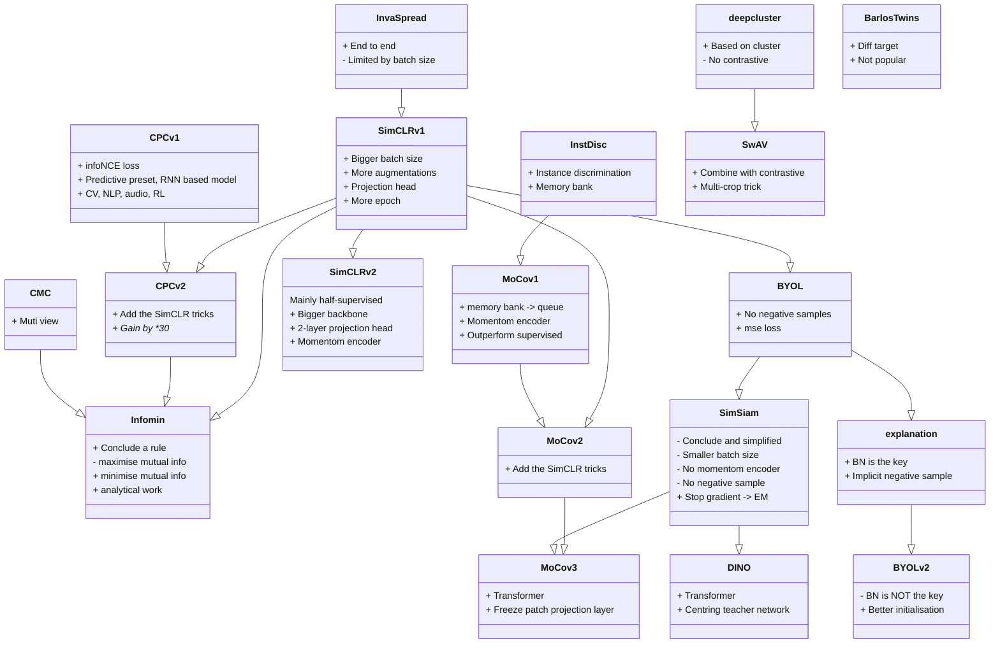



As a form of unsupervised learning, contrastive learning plays an ever more important role in deep learning. Here's a review of contrastive learning in CV since 2018, including 4 stages and 14 papers. This blog is written following the lead of this [review video](https://www.bilibili.com/video/BV19S4y1M7hm/).



<!-- more -->


This is a [series of paper reading notes](/2022/04/02/paper-reading-start/), hopefully, to push me to read paper casually and to leave some record of what I've learned.


Since, 2018, the development of contrastive learning can be concluded in 4 stages, and an overview is shown below:



- Wild growth
  - InstDisc[^1]
  - InvaSpread[^2]
  - CPC[^3]
  - CMC[^4]
- Two heroes
  - MoCo v1[^5]
  - SimCLR v1[^6]
  - MoCo v2[^7]
  - SimCLR v2[^8]
  - SwAV[^9]
- No negative samples
  - BYOL[^10]
    - Explanation
      - BYOL v2[^11]
    
  - SimSiam[^12]
  
- Transformer based
  - MoCo v3[^13]
  - DINO[^14]



## Brief introduction

> **Contrastive learning** is a machine learning technique used to learn *the general features* of a dataset **without labels** by teaching the model which data points are similar or different.

The idea is intuitive, given 3 pictures above; 2 cats and 1 dog. The goal of contrastive learning is to discriminate the cats from the dog by comparing the pixel similarity of them. Dive into the model, inputing $X_{cat1}, X_{cat2}, X_{dog}$ to a neural network. The distance between the resulting latent features of the 2 cats $L(f_{cat1}, f_{cat2})$ should approach 0 while those between the cats and the dog $L(f_{cat}, f_{dog})$ should approach infinity.

Contrastive learning is a very portable and flexible technique. It can be used anywhere as long as you can design a rule (**preset task**) to define which data are similar (**positive sample**) and which are different (**negative sample**). In the above example, one defines the pictures of the same species as positive, and those of different species as negative.

Actually, although it is usually seen as an unsupervised technique, contrastive learning is not meant to be unsupervised. As we can see above, under that context (**preset task**), it is more like a supervised constrained clustering. The model still relies on labeled datasets containing pictures of each species. But people manage to make this technique unsupervised or self-supervised in CV by designing clever **preset tasks**. For example, the **instance discrimination** we are about to see below.

Except from designing of the **preset task**, another key point is the design of **loss function**. The preset task sets the goal of training while the loss function defines how to do it. Unlike the loss functions that are often used in discrimination learning (cross entropy) or generative learning (L1-L2 loss), contrastive losses measure the similarity of each feature, which varies as the encoded features keep updating with epochs[^5] . Different kinds of loss functions are developed by follow up papers to improve the training efficiency and stability. 

## Stage 1: Wild growth(-2019mid)

At this stage, preset tasks, loss function, model and research area are not unified.

### InstDisc[^1]

#### Preset task

The figure above perfectly explains the motive and goal of the instance discrimination. Just as the name suggests, it extends the discrimination task from the previous class level to the instance level i.e. every single instance is a class.

#### Method

As shown above, InstDisc[^1] proposes a CNN (ResNet50) based model that encodes a batch (batch size 256) of figures into a latent feature space(128D), where the distance between each figure are maximised. The way of training such a model is through contrastive learning. For one feature encoded from a particular image, the **positive samples** are the features encoded from the augmentations of the picture and the **negative samples** are obtained by sampling(4096) the set of features encoded from all the other images. In this way, the model becomes self-supervised. To modify the general example above, instance discrimination task can be illustrated as below.

Besides, in order to save all the negative features without blowing up the memory, a memory bank is proposed. In every epoch, 4098 negative features are sampled from the memory bank. And the memory bank is updated with features in each epoch, under a method of proximal regularisation.

#### Loss function

**Noise Contrastive Estimation**(NCE) loss is applied to push away the negatives while clustering the positives..

#### Comment

This paper proposes the fundamental preset task instance discrimination. Together with the NCE loss, a fine result is achieved. Besides, the idea of saving a bounden of negative samples with other data structures, the proximal regularisation (momentum updated memory bank) method inspires the following queue method and the momentum updated decoder[^5] Even the super-parameter setting is also typical and a lot of work follows, including MoCo v1[^5]. 

### InvaSpread[^2]

Less influential as it is, this paper can be seen as a preliminary work of the SimCLR v1[^6]. Unlike InstDisc[^1]with additional structure to save negative samples, the positive and negative samples in InvaSpread[^2] are from the same batch. And only one encoder is used to process the samples. 

#### Method

The preset task is still instance discrimination, while the sampling is done in a different way. As shown above, assuming $x_1$ as the original, the positive sample is $[\hat{x}_1]$, while the negative sample is $[x_2,x_3,\hat{x}_2,\hat{x}_3]$, which means taking batch size as 256, the resulting positive and negative sample sizes are $256$ and $(256-1)*2$ respectively. 

Recalling InstDisc[^1], the negative sample is from outside this batch and the size can be much larger. Yet the downside part of it is that it requires another encoder for the negatives. Whereas, with positive and negative in one batch, only one encoder is needed and the model thus becomes end-to-end.

The loss function employed is a variant of the NCL loss.

#### Comment

Together with the SimCLR series, these papers stand for another route of contrastive learning, which is featured by:

- End-to-end
- Only one encoder
- No reliance on extra data structures
- Positive and negatives are in the same batch

This paper is very similar to SimCLR but has rather mediocre performance. There are several reasons:

- The batch size is too small - only 256, not enough negative samples (no TPU, no money)
- No powerful augmentations or the MLP projector that are proposed by SimCLR v1[^6]

### CPC[^3]

Apart from instance discrimination, this paper proposes another **pretext task** - contrastive predictive coding, a reminiscence of the difference between discriminative and generative models. And this approach is generalisable enough to copes with audio, images, text, and even reinforcement learning.

#### pretext task 

Given a temporal sequence, the encoded features of the sequence before time t are fed into an auto-regressive network (RNN or LSTM). The "origin" is defined as the RNN predicted features after time t $\hat{z}_{t+1} - \hat{z}_{t+4}$, the positive sample $z_{t+1} - z_{t+4}$, is defined as the features encoded from feature data $x_{t+1} - x_{t+4}$. The negative samples can be flexible, a typical way is the features encoded from data other than $x_{t+1} - x_{t+4}$.

In this way, the input $X$ can vary from picture patches, audio, video etc.

### CMC[^4]

CMC propose a more general way of defining positive sample, basically the different view of one instance can be defined as positive. 

#### Motivation

It is perfectly presented in the abstract, here is just a paraphrase. In the real world, information from different angle of view such as smell, sight and touch describe one thing together. Though these *sensory channels* might be different, the high level features such as physics, geometry and semantics tend to be same. And this preset task aims to train a view-invariant model.

#### Pre-text task

As the figure above illustrates, the representations of the same scene, no matter which view, are set as positive while representations from different scene as negative.

#### Loss function

The contrastive Learning loss is designed to maximise the mutual information between features of different views.

#### Comment

CMC is one of the first works to apply contrastive learning to multi-view problems. It demonstrates the flexibility of contrastive learning, and the portability of applying it to multi-view problems. As a result, OpenAI developed the famous Clip[^16] model, where the image and its language description are seen as a positive pair. 

One slight drawback of multi-view might be the need for different encoders to handle different views. For example, in Clip[^16], ViT and a large scale language model are applied to process different modes. Yet, given the various applications of transformer, this drawback may be addressed by processing multi-model problems via one single transformer model. Here is a example of doing it - MA-CLIP[^18].

## Stage 2: Two heroes(2019mid-2020mid)

Their are MoCo and SimCLR. In this stage, the development is very fast. The time intervals between each works introduced below are typically 1-2 months, even less than 1 month. And the SOTA on imageNet were refreshed every month. And the model architecture (encoder then projection), loss function(infoNCE), momentum encoder setting, more powerful method augmentation and more epochs tend to come together. And the result trend to the supervised learning accuracy.

### MoCo v1[^5]

It is the milestone of CV contrastive learning, and it is the first model that outperform supervised learning. It is a breakthrough that rise the confidence of unsupervised learning.

#### Method

As highlighted above, MoCo has two contributions: (1) momentum encoder (2) queue

MoCo stands for momentum contrast. Compared with InstDisc[^1], MoCo updates the encoder with momentum to prevent the encoder changing too rapidly between two batches. Besides, the application of queue instead of memory bank makes sure to update the negative dictionary efficiently.

Further more, MoCo introduces another loss function called infoNCE, very similar to softmax.

#### Comment

Actually, the details of MoCo almost follows exactly the InstDisc[^1], including backbone of ResNet 50, 128D of output size, L2-norm of outputs, 0.07 of loss temperature, the data augmentation setting, 0.03 learning rate and 200 epochs of training. It seems like MoCo is just make some improvements to InstDisc[^1].

Nevertheless, MoCo is classic. The reason may be the effectiveness and the influential of  the improvements. For example, the momentum encoder setting is inherited by following SimCLR [^6], BYOL[^10], even the latest work.

Furthermore, the way of writing is just beautiful and the scope is much higher than an ordinary work. Instead of presenting those improvements that they made. The authors conclude the preliminary works as a task of dictionary look-up. Personally, I feel like I understand the contrastive learning only until I read through the introduction part of MoCO.

### SimCLR v1[^6]

SimCLR stands for Simple Contrastive learning,  it is easy to understand and often used as example in many introduction blogs. The only drawback is the requirement of large batch size.

#### Method

It is very similar to InvaSpread[^2], the positive size is $N$ While the negative size is $2(N-1)$ . The key contribution is a "projection head(mlp with linear then RELU)" after the shared encoder, only applied during the training process. The improvement results in a gain of the accuracy up to 10%.

A loss function similar to infoNCE is used to maximise the agreement between positive and negative samples.

#### Data augmentation ablation

SimCLR does a detailed ablation test searching the most effective augmentation method, as it is crucial for the contrastive learning. As shown above all kinds of augs are listed and studied. And the result, as concluded in the heat-map below, shows the best 2 augmentation methods are crop and colour.

#### Projection ablation

Two piece of information in this result:

- The non-linear(linear with RELU) rise accuracy up by 10%
- The output size makes less difference to the accuracy, so afterwards works tend to choose small size as well. 128 is enough.

#### Comments

The full contributions compared with  InvaSpread[^2] are: 

- More data augmentatinon
- Learnable projection head layer
- Bigger batch size
- More epoch

The authors are as humble as admitting most of these contributions are not novel in the later part of the article. 

> We note that almost all individual components of our framework have appeared in previous work, although the specific instantiations may be different. The superiority of our framework relative to previous work is not explained by any single design choice, but by their composition.

However, similar to MoCo[^5], the contributions of this paper are also very influential. For example, the projection head after the encoder is adopted in following MoCo v2[^7] , SwAV[^9]and BYOL[^10]. And the data augmentation scheme is also widely applied. The the LARS optimiser for large batch size appears in BYOL[^10] as well.

And because of the good results of MoCo[^5], and SimCLR, contrastive learning lead a dominant trend in deep learning from 2020. And ended until the proposing of Vision Transformer.

### MoCo v2[^7]

It is technically a technical report. They note the effectiveness of the projection head and data augmentation method that SimCRL presented. After just less than 1 month, they merge these techniques into MoCo resulting in new SOTA on ImageNet.

#### Results

From the ablation result above, it is notable that the acc gains 6% with only projection head. And a large number of epochs are useful. As a matter of fact, the trend of increasing epochs still keeps. Recall the new MAE, 1600 epochs are adopted and the accuracy keeps rising.

Besides, they present MoCo v2 outperforms SimCLAR from two angle of views

- MoCo v2 is able to reach higher accuracy with less epochs
- The memory and time cost of MoCo is much lower to get a good result

#### Comment

MoCo v2 may be the most memory friendly method to get a good result with contrastive learning. And it still very useful.

### SimCLR v2[^8]

Actually most part of this paper focus on semi-supervised leaning. The SimCLR v2 part presented 3 points:

- Bigger backbone model size, 153-layer SKnet
- Deeper projection head, 2 layers MLP after a search of layer number
- Momentum encoder inspired by MoCo[^6][^7], but less effective. And they claim the reason is that the batch size of SimCLR is already big.

### SwAV[^9]

SwAV abbreviates for Swapped Assignment Views. This another multi-view work, aiming at predicting one view's feature from another view. And it combines contrastive leaning with clustering. 

#### Method

Unlike the former contrastive task, instead of enacting contrastive loss between positive and sampled negative features, SwAV compares positive with all negative features via clustering and swap prediction. 

#### Multi-crop augmentation

In additional to the great clustering setting, SwAV proposes another type of augmentation, multi-crop. With multi-crop, the model manages to learn information not only from large scale but small scale of an image, with similar computation cost.

It can be seen that the multi crop improve the accuracy on all the approaches, especially on the clustering related ones. And this technique can be seen as a critical contribution to reach SOTA. And it is adopted by a lot following models.

#### Result

The result of SwAV not only surpasses the preliminaries, but afters. It keeps SOTA that a convolutional backbone achieves until ViT models appear.

As shown above, with only linear probe (froze all but the last layer) the SwAV result is very near to the supervised baseline. And the result converges to the supervised result with the model size. 

##  Stage 3: No negative samples

Basically around BYOL and at last SimSiam integrates all the contributions before and makes a closure for the CNN based contrastive learning era. 

### BYOL[^10]

Bootstrap Your Own Latent is the longer version. Negative samples are critical for preventing model collapsing (same output regardless the input, loss always 0, learn nothing). In this new approach, no negative is required.

#### Model

The approach is simple, after classical momentum encoder, and momentum projector, another layer (same architecture with projection) is added to the positive line. Then the model is trained to predict the negative output with the output of the positive line.

#### Analysis

The result is truly surprising and it resulted in quite a topic. One of the most influencial analytical works is this blog: [Understanding Self-Supervised and Contrastive Learning with "Bootstrap Your Own Latent" (BYOL)](https://generallyintelligent.ai/blog/2020-08-24-understanding-self-supervised-contrastive-learning/).

| Name               | Projection MLP Norm | Prediction MLP Norm | Loss Function | Contrastive | Performance [5](https://generallyintelligent.ai/blog/2020-08-24-understanding-self-supervised-contrastive-learning/#fn-5) |
| ------------------ | ------------------- | ------------------- | ------------- | ----------- | ------------------------------------------------------------ |
| Contrastive Loss   | None                | None                | Cross Entropy | Explicit    | 44.1                                                         |
| BYOL               | Batch Norm          | Batch Norm          | L2            | Implicit    | 57.7                                                         |
| Projection BN Only | Batch Norm          | None                | L2            | Implicit    | 55.3                                                         |
| Prediction BN Only | None                | Batch Norm          | L2            | Implicit    | 48                                                           |
| No Normalization   | None                | None                | L2            | None        | 28.3                                                         |
| Layer Norm         | Layer Norm          | Layer Norm          | L2            | None        | 29.4                                                         |
| Random             | —                   | —                   | —             | None        | 28.8                                                         |

The blog author tried to reproduce the BYOL but got model collapsing all the time. So he checked the model and found the reason is one batch norm layer missing in his projection heads. And he did a series of ablation tests on batch normalisation and raise a hypnosis that BYOL leverage batch normal layers as a source of implicit "negative" samples. i.e. positive samples are not the only sample needed.

> **the presence of batch normalisation implicitly causes a form of contrastive learning**.

### BYOL v2[^11]

The previous blog made a huge influence and the conclusion was widely accepted, exceot the authors. As a result, another article was published entitled "BYOL works *even* without batch statistics"

In this paper, a more detailed ablation experiment was applied. And it shows the batch norm works as it designed, just a method to improve the stability of training.

Besides, the authors use a better initialisation (group normalisation) , and the model maintains a similar accuracy without any batch norm layer.

### SimSiam[^12]

After all these works, people found the contrastive learning's performance is accumulated by many techniques and tricks, a little too messy. In this context, He et al proposed a simple SimSiam network.

As shown above, SimSiam is basically a BYOL excluding the momentum encoder.

And a detailed comparison of results are provided, including classification and downstream tasks. Note that SimCLR and MoCo v2 performs the best on downstream tasks.

## Stage 4: Transformer based

Because of the popularity of vision transformer[^15], the backbones of the contrastive learning methods are substituted into transformer. And the works aim at analysing and solving the resulting unstable problem.

### MoCo v3[^13]

Although the title of MoCo v3 includes ViT, it is mostly a architecture that coping with all backbones. 

#### Method

From the algorithm, the MoCo v3 is a combination of MoCo v2 and SimSam. From the big picture, a query encoder and momentum key encoder with the contrastive loss are inherited from MoCo v2, while in the detail, a prediction mlp layer after the projection layer, a symmetric loss function recall the SimSiam.

#### Transformer based model instability

Because of the popularity of ViT, they substitute the backbone as ViT and find instability in training process. As shown above, the training accuracy tend to drop severely then increase gradually especially with large batch size. In this condition, large batch size has a negative impact on accuracy.

#### Trick

To alleviate the fluctuation, they retrieves the gradients of each layer and find the huge gradient change always occur on first layer (tokenisation patching layer). As a result, they try froze the first layer after random initialisation, and the problem solved. Note that this trick is useful for both MoCo v3 and BYOL with ViT.

### DINO[^14]

Short for self-**di**stillation with **no** labels, DINO is actually a follow-up work of BYOL. The student and teacher networks are same as the query and key network respectively. One contribution is the centring layer in the teacher network. And the algorithm is very similar to MoCo v3, same forward process with slightly different loss function.

## Conclusion

The relationships can be included in this diagram below:

## Reference

[^1]: [Wu, Z., Xiong, Y., Yu, S. X., & Lin, D. (2018). Unsupervised feature learning via non-parametric instance discrimination. In Proceedings of the IEEE conference on computer vision and pattern recognition (pp. 3733-3742).](http://openaccess.thecvf.com/content_cvpr_2018/html/Wu_Unsupervised_Feature_Learning_CVPR_2018_paper.html)
[^2]: [Ye, M., Zhang, X., Yuen, P. C., & Chang, S. F. (2019). Unsupervised embedding learning via invariant and spreading instance feature. In *Proceedings of the IEEE/CVF Conference on Computer Vision and Pattern Recognition* (pp. 6210-6219).](http://openaccess.thecvf.com/content_CVPR_2019/html/Ye_Unsupervised_Embedding_Learning_via_Invariant_and_Spreading_Instance_Feature_CVPR_2019_paper.html)
[^3]: [Van den Oord, A., Li, Y., & Vinyals, O. (2018). Representation learning with contrastive predictive coding. *arXiv e-prints*, arXiv-1807.](https://ui.adsabs.harvard.edu/abs/2018arXiv180703748V/abstract)
[^4]: [Tian, Y., Krishnan, D., & Isola, P. (2020, August). Contrastive multiview coding. In *European conference on computer vision* (pp. 776-794). Springer, Cham.](https://link.springer.com/chapter/10.1007/978-3-030-58621-8_45)
[^5]: [He, K., Fan, H., Wu, Y., Xie, S., & Girshick, R. (2020). Momentum contrast for unsupervised visual representation learning. In *Proceedings of the IEEE/CVF conference on computer vision and pattern recognition* (pp. 9729-9738).](http://openaccess.thecvf.com/content_CVPR_2020/html/He_Momentum_Contrast_for_Unsupervised_Visual_Representation_Learning_CVPR_2020_paper.html)
[^6]: [Chen, T., Kornblith, S., Norouzi, M., & Hinton, G. (2020, November). A simple framework for contrastive learning of visual representations. In *International conference on machine learning* (pp. 1597-1607). PMLR.](http://proceedings.mlr.press/v119/chen20j.html)
[^7]:[Chen, X., Fan, H., Girshick, R., & He, K. (2020). Improved baselines with momentum contrastive learning. *arXiv preprint arXiv:2003.04297*.](https://arxiv.org/abs/2003.04297)
[^8]: [Chen, T., Kornblith, S., Swersky, K., Norouzi, M., & Hinton, G. E. (2020). Big self-supervised models are strong semi-supervised learners. *Advances in neural information processing systems*, *33*, 22243-22255.](https://proceedings.neurips.cc/paper/2020/hash/fcbc95ccdd551da181207c0c1400c655-Abstract.html)
[^9]: [Caron, M., Misra, I., Mairal, J., Goyal, P., Bojanowski, P., & Joulin, A. (2020). Unsupervised learning of visual features by contrasting cluster assignments. *Advances in Neural Information Processing Systems*, *33*, 9912-9924.](https://proceedings.neurips.cc/paper/2020/hash/70feb62b69f16e0238f741fab228fec2-Abstract.html)
[^10]: [Grill, J. B., Strub, F., Altché, F., Tallec, C., Richemond, P., Buchatskaya, E., ... & Valko, M. (2020). Bootstrap your own latent-a new approach to self-supervised learning. *Advances in Neural Information Processing Systems*, *33*, 21271-21284.](https://proceedings.neurips.cc/paper/2020/hash/f3ada80d5c4ee70142b17b8192b2958e-Abstract.html)
[^11]: [Richemond, P. H., Grill, J. B., Altché, F., Tallec, C., Strub, F., Brock, A., ... & Valko, M. (2020). BYOL works even without batch statistics. *arXiv preprint arXiv:2010.10241*.](https://arxiv.org/abs/2010.10241)
[^12]: [Chen, X., & He, K. (2021). Exploring simple siamese representation learning. In *Proceedings of the IEEE/CVF Conference on Computer Vision and Pattern Recognition* (pp. 15750-15758).](http://openaccess.thecvf.com/content/CVPR2021/html/Chen_Exploring_Simple_Siamese_Representation_Learning_CVPR_2021_paper.html)
[^13]: [Chen, X., Xie, S., & He, K. (2021). An empirical study of training self-supervised vision transformers. In *Proceedings of the IEEE/CVF International Conference on Computer Vision* (pp. 9640-9649).](http://openaccess.thecvf.com/content/ICCV2021/html/Chen_An_Empirical_Study_of_Training_Self-Supervised_Vision_Transformers_ICCV_2021_paper.html)
[^14]: [Caron, M., Touvron, H., Misra, I., Jégou, H., Mairal, J., Bojanowski, P., & Joulin, A. (2021). Emerging properties in self-supervised vision transformers. In *Proceedings of the IEEE/CVF International Conference on Computer Vision* (pp. 9650-9660).](http://openaccess.thecvf.com/content/ICCV2021/html/Caron_Emerging_Properties_in_Self-Supervised_Vision_Transformers_ICCV_2021_paper.html)
[^15]:[Dosovitskiy, A., Beyer, L., Kolesnikov, A., Weissenborn, D., Zhai, X., Unterthiner, T., ... & Houlsby, N. (2020). An image is worth 16x16 words: Transformers for image recognition at scale. *arXiv preprint arXiv:2010.11929*.](https://arxiv.org/abs/2010.11929)
[^16]:[Radford, A., Kim, J. W., Hallacy, C., Ramesh, A., Goh, G., Agarwal, S., ... & Sutskever, I. (2021, July). Learning transferable visual models from natural language supervision. In *International Conference on Machine Learning* (pp. 8748-8763). PMLR](http://proceedings.mlr.press/v139/radford21a)
[^17]:[Dosovitskiy, A., Beyer, L., Kolesnikov, A., Weissenborn, D., Zhai, X., Unterthiner, T., ... & Houlsby, N. (2020). An image is worth 16x16 words: Transformers for image recognition at scale. *arXiv preprint arXiv:2010.11929*.](https://arxiv.org/abs/2010.11929)
[^18]: [You, H., Zhou, L., Xiao, B., Codella, N. C., Cheng, Y., Xu, R., ... & Yuan, L. (2021). MA-CLIP: Towards Modality-Agnostic Contrastive Language-Image Pre-training.](https://openreview.net/forum?id=ROteIE-4A6W)
